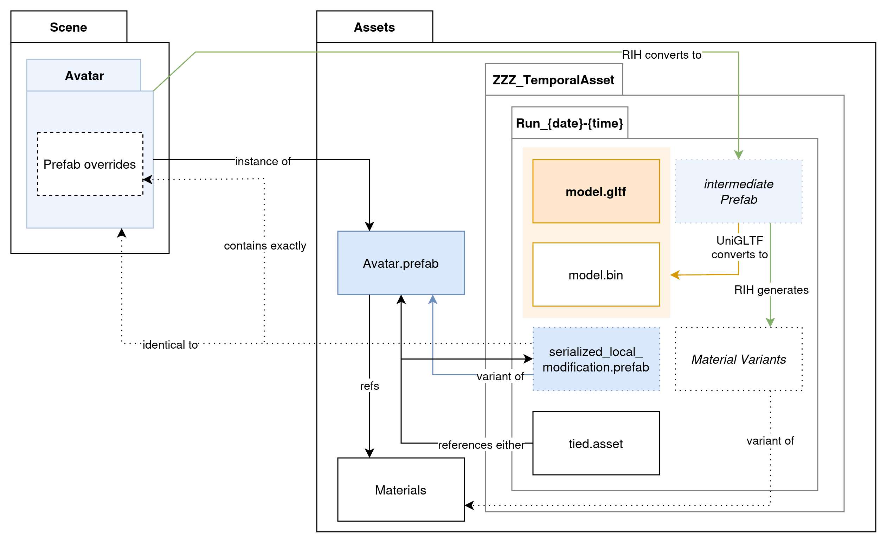

# Folder structure
There are a few file in the containing folder.

Containing folder can be found in `Assets/ZZZ_TemporalAsset/Run_{date}-{time}`.

* The file ending with `.gltf` - The converted glTF file. \
  The name is determined from your input. For example, Mafuyu will be exported as `Mafuyu.gltf`.
* Backlink-related files. These file will not be created if original hierarchy not a Prefab.
    * `serialized_local_modification.prefab` - Used for backlink. \
      Created if the Prefab instance has yet-saved [overrides](https://docs.unity3d.com/2022.3/Documentation/Manual/PrefabInstanceOverrides.html).
    * `tied.asset` - Contains backlink. Refers either `serialized_local_modification.prefab` or original Prefab.

