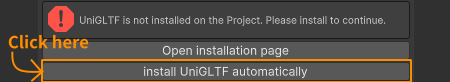
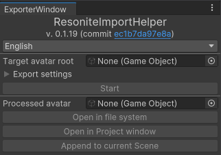
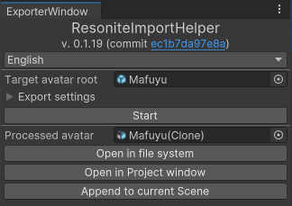

# How to getting started
<!-- TODO -->
NOTE: this article is getting old. Major rewrite is coming soon.

> [!TIP]
> You may want to refer [article](https://dinosaur-fossil.hatenablog.com/entry/2024/09/11/215603) written in Japanese by Yoshi, community member.

## Install
### UniGLTF
You have to install UniGLTF before starting.
RIH can download and configure it automatically, so you may skip this step:

This method is equivalent to install from their [GitHub release][unigltf-release] page.
[unigltf-release]: https://github.com/vrm-c/UniVRM/releases/tag/v0.128.0

### RIH itself
RIH can be installed in either way:
* [From VPM-compatible index](#rih-itself-by-vpm-compatible-index) - recommended for non-tech user
* [From git](#rih-itself-by-git) - recommended for tech user and cutting-edge user

#### RIH itself by Git
Summary: Install this package via [Unity's Package Manager](https://docs.unity3d.com/2022.3/Documentation/Manual/upm-ui-giturl.html).

Obtain Git installer from [gitforwindows.org](https://gitforwindows.org/) (or alternative proper and favorite method) if you do not have one.

After installed git, open your Project.

> [!TIP]
> You do not have to create separate project. RIH is designed to be non-destructive.

On your project, do following:
1. Go to `Window > Package Manager`
2. Click `[+▼]`
3. Select "Add package from Git URL"
4. Type `https://github.com/KisaragiEffective/ResoniteImportHelper.git#0.1.19`

Snippet after `#` specifies revision to be installed. By this configuration, you specify latest tagged version. This is recommended style. Refer [Unity's manual](https://docs.unity3d.com/2022.3/Documentation/Manual/upm-git.html) to customize or install other version.

> [!WARNING]
> You may not want to refer un-tagged version. This is because doing so implies always fetch latest version, and it may have buggy code snippet.
> Tagged versions are slightly more stable.

#### RIH itself by VPM-compatible index
Summary: Add ksrgtech repository, then choose "Resonite Import Helper" (or `io.github.kisaragieffective.resonite-import-helper`).

Before installing, you have to add ksrgtech repository. Refer [VCC manual](https://vcc.docs.vrchat.com/guides/community-repositories/).

The client will request you to feed an URL which points to the repository. Type `https://raw.githubusercontent.com/ksrgtech/vpm-repository/refs/heads/live/index.json` to continue.

> [!TIP]
> For tech users: GitHub repository is published on <https://github.com/ksrgtech/vpm-repository>.

You might have to wait a moment. After that, find an item with name of "Resonite Import Helper".
I recommend to use latest non-pre-release version. As of writing, it is `0.1.17`, so please specify `0.1.17` from a pull-down.

> [!WARNING]
> For advanced users: pre-release is not suitable for your production environment!

> [!WARNING]
> Please take **back up Your Projects**, as always.

## Convert

> [!WARNING]
> The target avatar shall not have Missing Material on any renderer. \
> This is not supported: Those Material Slots will be ignored and be treated as the missing slot does not exist.
> Example:
>
> | # of order | Assigned Material |
> |:----------:|:-----------------:|
> |     1      |        Foo        |
> |     2      |     *Missing*     |
> |     3      |        Bar        |
>
> is treated as following:
>
> | # of order | Assigned Material |
> |:----------:|:-----------------:|
> |     1      |        Foo        |
> |     2      |        Bar        |
>

> [!WARNING]
> The target avatar shall not have Missing Script. This may supported in the future, but is not supported at this time.
> See [issue 168](https://github.com/KisaragiEffective/ResoniteImportHelper/issues/168) to learn why.

1. Go to `Tools > Resonite Import Helper`: \
   
2. Change language to Japanese if you prefer it.
3. Set avatar to be processed.
4. Configure "Export settings" if necessary. \
   Depending on your installation, following checkbox may change their state:
    * Invoke VRChat SDK preprocessor: Calls VRChat SDK preprocessor. \
      Implies "NDMF Manual Bake".
      This typically includes NDMF-based tools, VRCFury, etc. \
      This option cannot be used when the target does not have "VRC Avatar Descriptor".
    * NDMF Manual Bake: Calls NDMF Manual Bake. \
      This is useful when you are importing non-VRChat avatar.
5. Press "Start".
6. It will be processed. Usually this will take a few seconds.
7. The processed avatar appears on its field:\
   
8. Focus onto "Project" tab.
9. Click the processed avatar field. By doing, the Project tab focused to it.
10. Drag it to the Hierarchy. You can check if it does not look unexpectedly.
11. Press "Open in file system". File explorer will be pop up on top of screen.
12. Find a file ending with `.gltf` in the directory.
13. The glTF will be loaded into the world. Its forward direction is negative Z if you are feeding a VRC-ready avatar and you do not modify root rotation.

## Import
You drop the outcome onto Resonite window.

You can choose several options on import. I do not write it here because it is off-topic from RIH usage. But please make sure every material keeps their looks to avoid reworking.

Finally, implement workaround or find alternative solution.
The following Unity and Platform-specific components cannot be exported because glTF lacks corresponding concept:
* **Animation**.
    * Workaround: Configure ProtoFlux to toggle properties.
* **Expression Menu**.
    * Workaround: Set up [Context Menu](https://wiki.resonite.com/Category:Components:Radiant_UI:Context_Menu) to achieve similar effect.
* Any Renderer that is not a SkinnedMeshRenderer nor a MeshRenderer.
    * Example: [Trail Renderer](https://docs.unity3d.com/2022.3/Documentation/Manual/class-TrailRenderer.html).
* Unity Constraints and VRC Constraints.
    * Workaround: re-implement similar logic by in-game Component and ProtoFlux nodes (thanks to Aetoriz's [post](https://misskey.resonite.love/notes/9ynqyi16tj)):
        * Look At Constraint and Aim Constraint map to [LookAt component][Component:LookAt].
        * Parent Constraint maps to [VirtualParent component][Component:VirtualParent].
        * Position Constraint and Rotation Constraint map to [CopyGlobalTransform component][Component:CopyGlobalTransform].
        * Scale Constraint maps to [CopyGlobalScale component][Component:CopyGlobalScale].
* FinalIK.
* Dynamic Bone and VRC PhysBone.
    * Workaround: Configure Dynamic Bone in Resonite.
* VRC Contact.
* VRC HeadChop.
* VRC SpatialAudioSource.
* VRC Station.
* Particle System.
* Rigidbody.

[Component:LookAt]: https://wiki.resonite.com/Component:LookAt
[Component:VirtualParent]: https://wiki.resonite.com/Component:VirtualParent
[Component:CopyGlobalTransform]: https://wiki.resonite.com/Component:CopyGlobalTransform
[Component:CopyGlobalScale]: https://wiki.resonite.com/Component:CopyGlobalScale
