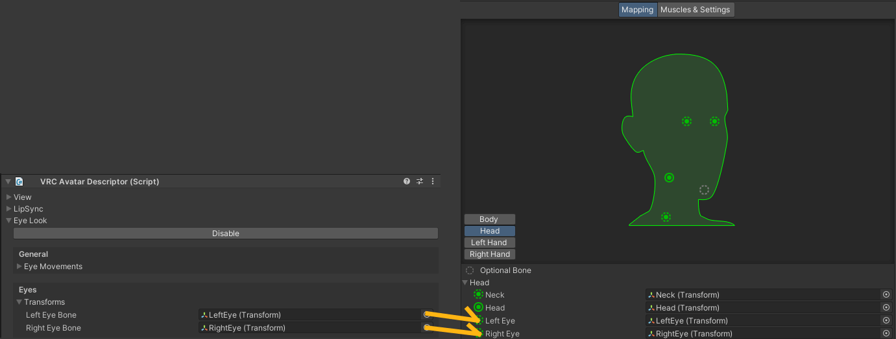

# Troubleshooting
## false-positive NOIK
RIH recognizes [HUMANOID][UNITY-AVATAR] bones from [ANIMATOR COMPONENT]. Please re-check if necessary HUMANOID bones are assigned.

If it is made for VRChat, and has [VRChat Avatar Descriptor], additional logic applies:
* If [UNITY-AVATAR] does not have left eye bone or right eye bone, RIH pulls them from the Descriptor. \
  

## false-negative NOIK
* If your avatar is not treated as [HUMANOID][UNITY-AVATAR], then RIH does not flag any bone [NOIK].
    * If your avatar is actually humanoid, please configure as being from [RIG-TAB].
    * This is technical limitation, because RIH can't determine which bone should be used as IK bone.

## NOIK is not respected
It may be a known issue on Resonite side.

There is a report for hand bones, see https://github.com/Yellow-Dog-Man/Resonite-Issues/issues/1031 for more information.

## semi-transparent texture is exported as opaque texture
This is implemented in release [0.1.13](https://github.com/KisaragiEffective/ResoniteImportHelper/releases/tag/0.1.13).

Please report bug if it does not solve your case.

[UNITY-AVATAR]: https://docs.unity3d.com/2022.3/Documentation/Manual/ConfiguringtheAvatar.html
[RIG-TAB]: https://docs.unity3d.com/2022.3/Documentation/Manual/FBXImporter-Rig.html
[ANIMATOR COMPONENT]: https://docs.unity3d.com/2022.3/Documentation/Manual/class-Animator.html
[NOIK]: https://wiki.resonite.com/Humanoid_Rig_Requirements_for_IK#Ignoring_Bones
[VRChat Avatar Descriptor]: https://creators.vrchat.com/avatars/creating-your-first-avatar#step-5---adding-an-avatar-descriptor

## Converted model looks like far from original, what went wrong?
Typically, this is caused by Custom Shaders.

> [!NOTE]
> Definition: Custom Shader \
> Any Shader on Unity *except* Unity's Standard Shader is considered as Custom Shader. \
> This including, but not limited to lilToon, Poiyomi, and UTS.

By default (and most case), following property are kept:
* Albedo and its transparency
* Normal map

Please let me know if that's not true.

Supporting around Custom Shader-specific properties in is poor.

However please remember that it will **never** be considered if you do not let me know.

Plus if you enabled "Bake lilToon's configuration into Texture" (behind Experimental Settings), Albedo is going to have those:
* Toon Correction
* 2nd / 3rd Main Texture
* Alpha Mask

It is not possible to cover all Custom Shaders. Because you may write one.
