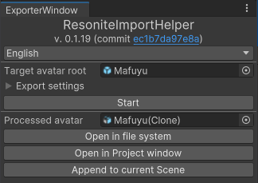

# はじめる
> [!TIP]
> このドキュメントは不完全なので、よっしーさんが書いた [記事](https://dinosaur-fossil.hatenablog.com/entry/2024/09/11/215603) も合わせてご覧ください。

## インストール
ResoniteImportHelper に興味を持っていただきありがとうございます。

インストールした時点で [使用許諾条件](https://github.com/KisaragiEffective/ResoniteImportHelper/blob/7fb924393958a58152cd3040167d2855f0852ac6/LICENSE.txt) に同意したものとみなします。
続行する前に、使用許諾条件をよくお読みください。

### ResoniteImportHelper
ResoniteImportHelper は次のいずれかの方法でインストールすることができます。

1. [From VPM-compatible index](#rih-itself-by-vpm-compatible-index) - 技術者ではないユーザー、VRChat のユーザーにおすすめ
2. [From git](#rih-itself-by-git) - 技術者なユーザー、最新版を使いたいユーザーへおすすめ

いずれの方法でも、お使いのプロジェクトにインストールすることができます。

> [!TIP]
> ResoniteImportHelper のために別のプロジェクトを作成する必要はありません。RIH は お使いのプロジェクトを破壊しないように設計されています。

#### RIH を VPM互換レポジトリからインストール
要約: "ksrgtech" のレポジトリを追加し、 "Resonite Import Helper" (or `io.github.kisaragieffective.resonite-import-helper`) をパッケージマネージャーからインストールしてください。

インストールする前に、RIHがVRChat Creator Companion互換のクライアントで扱える形式としてホストされている "ksrgtech" のVRChat Package Manager互換レポジトリを追加する必要があります。 [VRChat Creator Companion の マニュアル](https://vcc.docs.vrchat.com/guides/community-repositories/) も参照してください。

VCC-互換クライアントはVPM-互換レポジトリを追加するためにURLを入力する必要があります。 `https://raw.githubusercontent.com/ksrgtech/vpm-repository/refs/heads/live/index.json` と入力して続行してください。

> [!TIP]
> 技術者向けの参考情報: "ksrgtech" のレポジトリは次の GitHub レポジトリでホストしています: <https://github.com/ksrgtech/vpm-repository>.

しばらく待った後に "ksrgtech packages" と書かれたレポジトリが出現するため、VCC-互換クライアントからレポジトリを有効にし、お使いのプロジェクトにインストールします。

既知のバグを避けるため、プレリリースではない最新のバージョンをインストールするようにしてください。執筆時点では `0.1.20` が最新のため、それを指定することを推奨します。

> [!WARNING]
> 発展的な用法としてプレリリース版をインストールすることも可能ですが、あなたのプロジェクトにインストールすると予期せぬ出来事が起こる原因となる可能性があります。プレリリース版をインストールする際はメインのプロジェクトとは異なるプロジェクトにインストールすることを**強く**推奨します。

> [!WARNING]
> いつもどおり**定期的にバックアップを取る**ようにしてください。この事項はRIHをインストールしなくても推奨される事項です。

#### RIH by Git
要約: [Unity の Package Manager](https://docs.unity3d.com/2022.3/Documentation/Manual/upm-ui-giturl.html) からこのレポジトリを UPM パッケージとしてインストールしてください。

最初に、Git をインストールしていない場合は [gitforwindows.org](https://gitforwindows.org/) から (あるいは、お使いのシステムによっては他の適切な方法によって) Git をインストールします。

Git をインストールしたら、お使いのプロジェクトを開いてください。

プロジェクトを開いたら、エディタ上部のツールバーから `Window > Package Manager` を選択して開きます。
その後、`[+▼]` のように見えるボタンをクリックし、"Add package from Git URL" と書かれたラベルをクリックします。
そうすると URL を入力するテキストボックスが出てくるので、以下のURLを入力してください。

`https://github.com/KisaragiEffective/ResoniteImportHelper.git#0.1.20`

`#`の後にあるのがインストールされるバージョンです。この推奨される構成を用いることで、執筆時点で公開されている最新のタグ付けされたバージョンを使うことができます。カスタマイズしたい場合、あるいは他のバージョンをインストールしたい場合は [Unity のマニュアル](https://docs.unity3d.com/2022.3/Documentation/Manual/upm-git.html) を参照してください。

> [!WARNING]
> タグ付けされていないリビジョンや`#` がない最新版をインストールする行為は何をしているのか把握していない限り行わないでください。そのようなリビジョンはタグ付けされているバージョンよりも不安定な可能性が高く、バグを含んでいる可能性があります。

### UniGLTF
ResoniteImportHelper は [UniGLTF][UniGLTF] を使用しているため、 UniGLTF をインストールする必要があります。

Unityエディターのウィンドウ上部にあるツールバーから Tools > ResoniteImportHelper を開いて、次のどちらかの手段でインストールすることができます。

1. **推奨**: ResoniteImportHelper にダウンロードさせる。
2. UniGLTF の [GitHubのリリースページ][unigltf-release] からunitypackageを手動でダウンロードし、プロジェクトに展開する。

[UniGLTF]: https://github.com/vrm-c/UniVRM/
[unigltf-release]: https://github.com/vrm-c/UniVRM/releases/tag/v0.128.0

次のような UI が表示されるので、1 の場合は「Install UniGLTF automatically」を、 2の場合は 「Open installation page」をクリックしてください。

「Install UniGLTF automatically」はシステムで [Git](https://git-scm.com/) が利用可能であれば UniGLTF を [UPM package](https://docs.unity3d.com/2022.3/Documentation/Manual/upm-ui-giturl.html) としてパッケージマネージャーに追加し、そうでなければunitypackageをダウンロードしてきて自動的に展開します。

注意: プロジェクトにUniVRMが入っている場合、UniVRMの更新は自動的には行われません。

## 変換

以上でインストールが終わったので、変換を行ってみましょう。
変換を行う前に、Missing MaterialとMissing Scriptがないかどうかチェックしてください。これらは技術的な制約によりRIHでうまく取り扱うことができず、情報が欠落したりエラーになったりします。

> [!WARNING]
> Missing Material は単に無視されます。例えば、
>
> | # of order | Assigned Material |
> |:----------:|:-----------------:|
> |     1      |        Foo        |
> |     2      |     *Missing*     |
> |     3      |        Bar        |
>
> は次のように扱われます:
>
> | # of order | Assigned Material |
> |:----------:|:-----------------:|
> |     1      |        Foo        |
> |     2      |        Bar        |
>

> [!WARNING]
> 変換するアバターのコンポーネントは Missing Script であることはできず、現段階ではサポートされていません。
> サポートされていない理由については [issue 168](https://github.com/KisaragiEffective/ResoniteImportHelper/issues/168) を見てください。

はじめに、 `Tools > Resonite Import Helper`を開きます。

デフォルトでは言語が英語なので、日本語に変えましょう。その後、変換するアバターをセットします。

<!-- TODO: 日本語UI -->

Export settingsを開き、設定を操作してください。

### Invoke VRChat SDK preprocessor
変換時、VRChat のアバター SDK が API として用意しているプリプロセッサへ通すかどうか決定します。別の言葉でいえば、このチェックボックスを有効にするとModular Avatar など NDMF を利用するツール や VRCFury などの処理が実行されます。

> [!WARNING]
> VRCFury との互換性は考慮されていません。

この設定をオンにしたとき、NDMFがインストールされていればNDMF Manual Bakeも自動的にオンになります。

> [!TIP]
> VRChat アバター SDK が NDMF のエントリーポイントを自動的に呼び出すためです。

デフォルト値: VRChat のアバター SDK が インストールされていない場合、オフ。インストールされている場合、変換されるアバターに「VRChat Avatar Descriptor」コンポーネントがつけられているかどうかに依存します。

### NDMF Manual Bake
変換時、NDMF Manual Bakeを行います。
Invoke VRChat SDK preprocessor を無効にした状態でこのチェックボックスを有効にすると、 VRCFury など NDMFとは別の仕組みによって動くオーサリングツールは変換時に実行されなくなります。

一方で、Modular Avatar、AAO: Avatar Optimizer、TexTransToolなどのNDMFによって動作するツールは変換時に実行されます。

設定を編集し終わったら、変換ボタンを押しましょう。

しばらくすると、下の図のように変換されたアバターが表示されるので、"Append to current Scene" を押しましょう。

そうすると、現在開いているシーンに変換されたアバターが出現するため、意図通りの変換になっているかどうか確かめてください。
この段階で確かめない場合、手戻りが発生します。必ず確認するようにしてください。
確認した後、Open in file systemを押してエクスプローラーを開きます。

## インポート
Resoniteをウィンドウモードで開いて変換した glTF を Resonite へドラッグアンドドロップしてください。
インポートに伴って設定画面が出現するため、[Wiki (英語)](https://wiki.resonite.com/3D_Model_Import) を見るとかでいい感じにしてください。このドキュメントではRIHのスコープをそれてしまうため解説を割愛します。

## 参考資料: Unity のコンポーネントのうち変換時に情報が失われるもの

ほとんどのUnity のコンポーネントやプラットフォーム (VRChat を含む) 依存のコンポーネントは変換時に情報が欠落します。
以下は、代表的な例と代案です。

* **Animator コンポーネントにおいて制御されるアニメーション**
    * 代案: ProtoFlux を使ってプロパティを切り替える。
* **Expression Menu**
    * 代案: [コンテキストメニュー](https://wiki.resonite.com/Category:Components:Radiant_UI:Context_Menu) をセットアップします。なお、ラジアルパペットの再現にはひと工夫必要です
* レンダラーのうち、 SkinnedMeshRenderer でも MeshRenderer でもないレンダラー
    * 例: [Trail Renderer](https://docs.unity3d.com/2022.3/Documentation/Manual/class-TrailRenderer.html)
* Unity Constraints と VRC Constraints
    * 代案: 似たようなゲームを Resonite のコンポーネントと ProtoFlux のノードで再現する (thanks to Aetoriz's [post](https://misskey.resonite.love/notes/9ynqyi16tj)):
        * Look At Constraint と Aim Constraint → [LookAt component][Component:LookAt].
        * Parent Constraint → [VirtualParent component][Component:VirtualParent].
        * Position Constraint と Rotation Constraint → [CopyGlobalTransform component][Component:CopyGlobalTransform].
        * Scale Constraint → [CopyGlobalScale component][Component:CopyGlobalScale].
* FinalIK
* Dynamic Bone and VRC PhysBone.
    * 代案: Resonite のDynamic Boneを設定します。
* VRC Contact.
* VRC HeadChop
    * 訳注: VRChat とは異なり、Resonite においてはデフォルトでHeadボーンの下にあるメッシュも見えるようになっています。
* VRC SpatialAudioSource
* VRC Station
    * 訳注: [AvatarAnchor][Component:AvatarAnchor] コンポーネントを使用してください。
* Particle System
    * 訳注: 代案: PhotonDust を使います。
* Rigidbody

[Component:LookAt]: https://wiki.resonite.com/Component:LookAt
[Component:VirtualParent]: https://wiki.resonite.com/Component:VirtualParent
[Component:CopyGlobalTransform]: https://wiki.resonite.com/Component:CopyGlobalTransform
[Component:CopyGlobalScale]: https://wiki.resonite.com/Component:CopyGlobalScale
[Component:AvatarAnchor]: https://wiki.resonite.com/Component:AvatarAnchor
