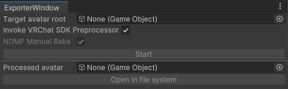
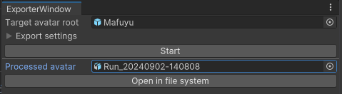
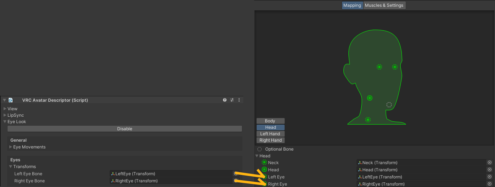
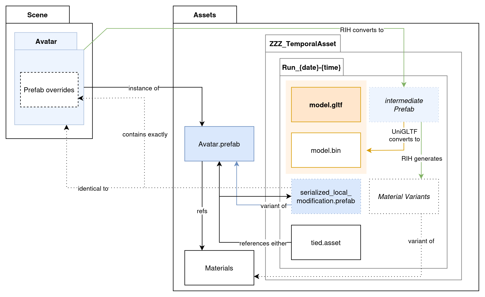

# Resonite Import Helper
Bake and Import.

## Requirement and recommended tools
* UniGLTF is required to run. Download it from their [GitHub repository](https://github.com/vrm-c/UniVRM/releases).
* Git is required to install. Download it from [gitforwindows.org](https://gitforwindows.org/).
* Unity® is required to be 2022.3 series. Older or newer series may work, but it will **NOT** be supported.

Following tools are optional. This tool can invoke their hooks.
* VRChat® Avatar SDK ([Download](https://creators.vrchat.com/sdk/))
* Non-Destructive Modular Framework (NDMF)
  * AAO: Avatar Optimizer ([Download](https://vpm.anatawa12.com/avatar-optimizer/en/))
  * Modular Avatar ([Download](https://modular-avatar.nadena.dev/))

## What this does and does not
### Does
* Flag non-Rig bone as [`<NoIK>`][NOIK]
* Rename bones to be [Rig-detector friendly](https://wiki.resonite.com/Humanoid_Rig_Requirements_for_IK#Bone_Requirements)
* Serialize processed avatar as glTF format
* Call VRChat Avatar Build hooks
* Call NDMF plugins

### Does not
* Convert Material: Always exported as Standard Shader. This is technical limitation on UniGLTF. You may import them as XiexeToonShader (or any suitable built-in Shader).
* Convert Animation: Always ignored. You may want to reconstruct them by Protoflux after importing.

## How to use and import
1. Install UniGLTF.
2. Install this package via Package Manager.
    1. Go to `Window > Package Manager`
    2. Click `[+▼]`
    3. Select "Add package from Git URL"
    4. Type `https://github.com/KisaragiEffective/ResoniteImportHelper.git#0.1.7`
3. Go to `Tools > Resonite Import Helper`: \
    
4. Set processing avatar.
5. Configure "Export settings" if necessary. \
    Depending on your installation, following checkbox may change their state:
    * Invoke VRChat SDK preprocessor: Calls VRChat SDK preprocessor. \
      Implies "NDMF Manual Bake".
      This typically includes NDMF-based tools, VRCFury, etc. \
      This option cannot be used when the target does not have "VRC Avatar Descriptor".
    * NDMF Manual Bake: Calls NDMF Manual Bake. \
      This is useful when you are importing non-VRChat avatar.
6. Press "Start".
7. It will be processed. Usually this will take a few seconds.
8. The processed avatar appears on its field:\
    
9. Press "Open in file system".
10. Drag `model.gltf` in the filesystem and drop it onto Resonite window.

### Trouble shooting
#### false-positive NOIK
RIH recognizes [HUMANOID][UNITY-AVATAR] bones from [ANIMATOR COMPONENT]. Please re-check if necessary HUMANOID bones are assigned.

If it is made for VRChat, and has [VRChat Avatar Descriptor], additional logic applies:
* If [UNITY-AVATAR] does not have left eye bone or right eye bone, RIH pulls them from the Descriptor. \
  
#### false-negative NOIK
* If your avatar is not treated as [HUMANOID][UNITY-AVATAR], then RIH does not flag any bone [NOIK].
  * If your avatar is actually humanoid, please configure as being from [RIG-TAB].
  * This is technical limitation, because RIH can't determine which bone should be used as IK bone.

#### semi-transparent texture is exported as opaque texture
This is [known bug](https://github.com/KisaragiEffective/ResoniteImportHelper/issues/50).

workaround: re-assign Texture on Resonite or UnityEditor.

[UNITY-AVATAR]: https://docs.unity3d.com/2022.3/Documentation/Manual/ConfiguringtheAvatar.html
[RIG-TAB]: https://docs.unity3d.com/2022.3/Documentation/Manual/FBXImporter-Rig.html
[ANIMATOR COMPONENT]: https://docs.unity3d.com/2022.3/Documentation/Manual/class-Animator.html
[NOIK]: https://wiki.resonite.com/Humanoid_Rig_Requirements_for_IK#Ignoring_Bones
[VRChat Avatar Descriptor]: https://creators.vrchat.com/avatars/creating-your-first-avatar#step-5---adding-an-avatar-descriptor

## Folder structure
There are a few file in the containing folder.

Containing folder can be found in `Assets/ZZZ_TemporalAsset/Run_{date}-{time}`.

* The file ending with `.gltf` - The converted glTF file. \
    The name is determined from your input. For example, Mafuyu will be exported as `Mafuyu.gltf`.
* Backlink-related files. These file will not be created if original hierarchy not a Prefab.
  * `serialized_local_modification.prefab` - Used for backlink. \
      Created if the Prefab instance has yet-saved [overrides](https://docs.unity3d.com/2022.3/Documentation/Manual/PrefabInstanceOverrides.html).
  * `tied.asset` - Contains backlink. Refers either `serialized_local_modification.prefab` or original Prefab.

## Versioning Policy
This project adopts ["Semantic Versioning 2.0.0"](https://semver.org/).

In addition to "Semantic Versioning 2.0.0", following rules applied:
* Each version component is increased by 1 in general release.
* If Major component is 0:
  * Minor component is increased and Patch component reset to 0 if:
      * Public API is changed in Not Backwards Compatible way
  * Patch component is increased if any of following happens:
      * New feature is implemented
      * Bug fix is applied
      * UI changes are made

Those are not counted as Public API:
* Any C# members (class, method, property, field, etc.) that:
  * cannot be accessed from outside the codebase without reflection and patching.
    * This includes `private`, `internal`, `private protected`, and `file` members.
  * marked with `[NotPublicAPI]`.
* Folder structure.
* Backlink component and its members.

This project may provide experimental feature or implementation.
It is allowed to be disappeared without marking it as Not Backwards Compatible.

## Disclaimer
glTF and the glTF logo are trademarks of the Khronos Group Inc.

Unity, the Unity logo, and all related names, logos, product and service names, designs, and slogans are registered trademarks of Unity Technologies or its subsidiaries.

VRChat and all related names are trademarks or registered trademarks of VRChat, Inc. (https://trademarks.justia.com/864/50/vrchat-86450229.html)

「VRM」は一般社団法人ＶＲＭコンソーシアムの商標又は登録商標です。 (登録6365806)

Developer nor commiter may NOT be associated with above organizations.
