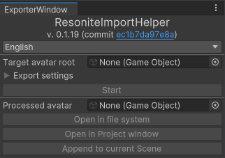

# Resonite Import Helper
Bake and Import.

## Requirement and recommended tools
* UniGLTF is required to run. Download it from their [GitHub repository](https://github.com/vrm-c/UniVRM/releases).
* Git is required to install. Download it from [gitforwindows.org](https://gitforwindows.org/).

Following tools are optional. This tool can invoke their hooks.
* VRChat Avatar SDK ([Download](https://creators.vrchat.com/sdk/))
* Non-Destructive Modular Framework
  * AAO: Avatar Optimizer ([Download](https://vpm.anatawa12.com/avatar-optimizer/en/))
  * Modular Avatar ([Download](https://modular-avatar.nadena.dev/))

## What this does and does not
### Does
* Flag non-Rig bone as [`<NoIK>`](https://wiki.resonite.com/Humanoid_Rig_Requirements_for_IK#Ignoring_Bones)
* Rename bones to be [Rig-detector friendly](https://wiki.resonite.com/Humanoid_Rig_Requirements_for_IK#Bone_Requirements)
* Serialize processed avatar as gLTF format
* Call VRChat Avatar Build hooks
* Call NDMF plugins

### Does not
* Convert Material: Always exported as Standard Shader. This is technical limitation on UniGLTF. You may import them as XiexeToonShader (or any suitable built-in Shader).
* Convert Animation: Always ignored. You may want to reconstruct them by Protoflux after importing.

## How to use and import
1. Install UniGLTF.
2. Install this package via Package Manager.
    1. Go to `Window > Package Manager`
    2. Click `[+▼]`
    3. Select "Add package from Git URL"
    4. Type `https://github.com/KisaragiEffective/ResoniteImportHelper.git#0.1.0`
3. Go to `Tools > Resonite Import Helper`: \
    
4. Set processing avatar.
5. Depending on your installation, following checkbox may change their state:
    * Invoke VRChat SDK preprocessor: Calls VRChat SDK preprocessor. \
      Implies "NDMF Manual Bake".
      This typically includes NDMF-based tools, VRCFury, etc. \
      This option cannot be used when the target does not have "VRC Avatar Descriptor".
    * NDMF Manual Bake: Calls NDMF Manual Bake. \
      This is useful when you are importing non-VRChat avatar.
6. Press "Start".
7. It will be processed. Usually this will take a few seconds.
8. The processed avatar appears on its field:\
    
9. Press "Open in file system".
10. Drag and drop the outcome onto Resonite.
